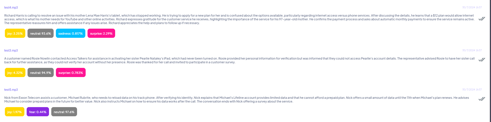
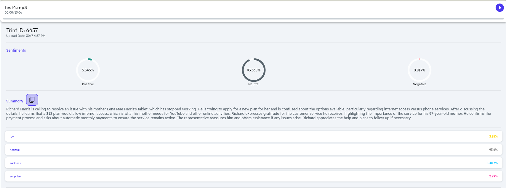
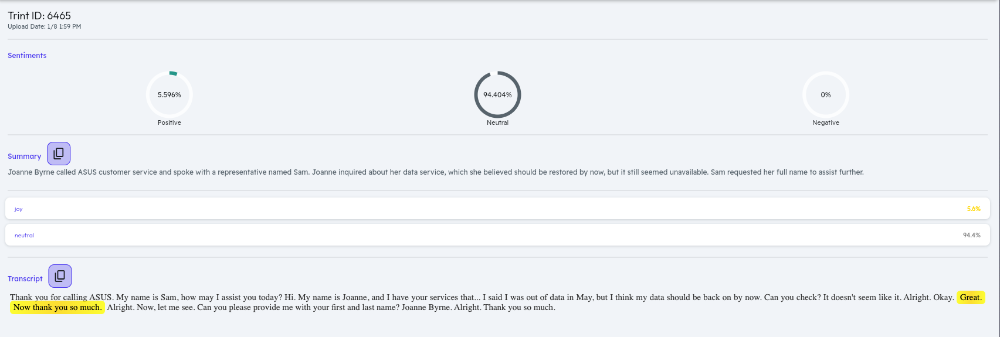

# TrintAI

## **Gain insights from audio files in minutes**
TrintAI is a powerful open source tool for converting speech into text. In addition to its transcription capabilities, it can generate summaries of the audio and detect sentiments and emotions.
Using TrintAI you can power your apps with cutting-edge speech recognition.

## Key Features
- **Speech-to-Text Transcription**: Converts audio files into accurate, readable text in real-time.
- **Summarization**: Provides concise summaries of long audio files or transcripts. This feature extracts the most important information and key points from the text, allowing you to quickly understand the main takeaways from meetings, calls, or any extended audio content.
- **Sentiment Analysis**: Detects emotions within the transcribed text.
- **Language Identification**: Detects the language spoken in the audio file and can transcribe in multiple languages.

More to come...

📣📣📣 We're currently seeking community maintainers, so don't hesitate to get in touch if you're interested! 📣📣📣

## Enterprise transcription services
We believe in open source and we believe we can take TrintAI to the next level. Here we provide a list of the most popular speech-to-text paid services in the market that can be use for feature comparison.
- [AssemblyAI](https://www.assemblyai.com/)
- [Deepgram](https://deepgram.com/)
- [Gladia](https://gladia.io)
- [Google Cloud](https://cloud.google.com/speech-to-text)
- [Microsoft Azure](https://azure.microsoft.com/en-us/products/cognitive-services/speech-to-text)
- [RevAI](https://www.rev.ai/)
- [Whisper](https://openai.com/blog/introducing-chatgpt-and-whisper-apis)


## Installation

### Prerequisites
- [Python >=3.11](https://www.python.org/)
- [ffmpeg](https://www.ffmpeg.org/)
- [pyAudioAnalysis](https://github.com/tyiannak/pyAudioAnalysis)
- [whisper](https://github.com/SYSTRAN/faster-whisper)
- [Mutagen](https://github.com/quodlibet/mutagen)
- [FastAPI](https://fastapi.tiangolo.com/)
- [openai](https://platform.openai.com/docs/libraries/python-library) (📣 only use for the **summarization** feature)


#### Hugginface Models
- [j-hartmann/emotion-english-distilroberta-base](https://huggingface.co/j-hartmann/emotion-english-distilroberta-base)
- [Systran/faster-whisper-large-v3](https://huggingface.co/Systran/faster-whisper-large-v3)


### Setup

1. Clone the repository:
```
git clone https://github.com/Trint-ai/TrintAI.git
```

2. Configure environment variables:
```
cp backend/.env.example backend/.env
```

3. Install python libraries:
```
cd backend
pip install -r requirements.txt
```

4. Run the application:
```
cd app
python main.py
```

### Usage
1. Send a request to TrintAI to process an audio file:
```
curl --header "Content-Type: application/json" \
        --request POST \
        --data '{"file":"https://mycustomdomain/audio.mp3"}' \
        http://localhost:8000/api
```

2. TrintAI return a JSON object with the following structure:
```
{
    'summary': str,
    'transcript': list
}
```
Where `transcript` structure is:
```
{
    'start': str,
    'end': str,
    'text': str
}
```

Example:
```
{
    "summary": {
        "summary": "Mario Burns called ILTECA Telecom to inquire about her data service, which she believed should be restored by now. Sam, the representative, asked for her name to assist her further."
    },
    "transcript": [
        {
            "start": 0.0,
            "end": 6.0,
            "text": " Thank you for calling ILTECA Telecom. My name is Sam. How may I assist you today?",
            "emotion": "neutral",
            "emotion_score": 0.7938371896743774
        },
        {
            "start": 6.0,
            "end": 21.0,
            "text": " Hi, my name is Mario and I have your services that I said I was out of data in May, but I think my data should be back on by now. Can you check? It doesn't seem like it.",
            "emotion": "neutral",
            "emotion_score": 0.5356881618499756
        },
        {
            "start": 21.0,
            "end": 28.0,
            "text": " Alright, okay, great. Now, thank you so much.",
            "emotion": "joy",
            "emotion_score": 0.7313963174819946
        },
        {
            "start": 28.0,
            "end": 39.0,
            "text": " Alright, now, let me see. Can you please provide me with your first and last name?",
            "emotion": "neutral",
            "emotion_score": 0.7319390177726746
        },
        {
            "start": 39.0,
            "end": 42.0,
            "text": " Mario Burns.",
            "emotion": "neutral",
            "emotion_score": 0.8114751577377319
        },
        {
            "start": 42.0,
            "end": 45.0,
            "text": " Alright, thank you.",
            "emotion": "neutral",
            "emotion_score": 0.5262356996536255
        }
    ]
}
```

## What you can do with TrintAI?
Use TrintAI speech-to-text application to analyze audio files from call centers, meetings, and calls. Gain insights from conversations, improve customer interactions, and streamline decision-making with accurate transcriptions.







## Looking for a custom solution?
Need a custom solution? [Reach out to us!](mailto:albertollamaso@gmail.com)
